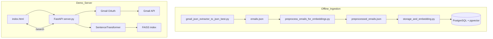

# Current Architecture

## Overview

This repository contains multiple iterations of a local email search system. The main pieces are:

- Scripts that download Gmail messages as JSON and preprocess them.
- A storage and embedding pipeline that loads the cleaned JSON into a pgvector‑enabled PostgreSQL database.
- A demo FastAPI server with a small HTML frontend that authenticates with Gmail, fetches messages on demand and performs FAISS based similarity search.

The code base therefore holds two paths: an offline ingestion pipeline that persists data in Postgres, and a lightweight server that builds an in‑memory index at runtime. Older experiments and utilities also live under `old_code_and_other_useless_stuff/`.

## High Level Diagram


## Component Descriptions

**Gmail Extraction (`gmail_json_extractor_to_json_best.py`)** – Stand‑alone script that runs the OAuth flow, fetches up to a few thousand messages (including attachments) from Gmail and writes them into `server_client_local_files/emails.json` grouped by conversation.

**Preprocessing (`preprocess_emails_for_embeddings.py`)** – Cleans HTML and whitespace from each email and produces `preprocessed_emails.json` which keeps only the useful fields.

**Storage and Embedding (`storage_and_embedding.py`)** – Loads the preprocessed JSON, creates BGE‑M3 embeddings and stores both email rows and aggregated conversation embeddings in PostgreSQL tables (`emails`, `conversations`) using pgvector. Provides CLI flags `--create` and `--update` for first‑time ingest or incremental updates.

**Demo FastAPI Server (`server_client_local_files/server.py`)** – Exposes endpoints `/login`, `/fetch_emails`, `/search` and `/disconnect`. It authenticates with Gmail on behalf of the user, pulls the newest 100 messages, generates embeddings with `all-MiniLM-L6-v2`, builds a FAISS index in memory and answers search requests. A small static web page (`index.html`) drives this flow via fetch calls.

**Updater (`email_json_database_updater.py`)** – Reads the existing `emails.json`, queries Gmail for anything newer than the latest stored message and merges the new results back into the JSON database. It reruns the preprocessing step after updates.

**New Approach (`new_approach/extract_update_preprocess.py`)** – Experimental unified script that combines OAuth, download, and preprocessing while writing directly to a per‑user database via an external `db_handler` module (not present in the repo).

**Misc Utilities** – A `mock_email_generator.py` for creating fake conversations, an old offline FAISS pipeline, and various prototypes under `old_code_and_other_useless_stuff/`.

## Inter-Script Communication

- `gmail_json_extractor_to_json_best.py` → `preprocess_emails_for_embeddings.py`
  - **Method:** File handoff (`emails.json`).
  - **Data:** JSON list of conversations and emails.
- `preprocess_emails_for_embeddings.py` → `storage_and_embedding.py`
  - **Method:** File handoff (`preprocessed_emails.json`).
  - **Data:** Cleaned JSON with fields `id`, `conversation_id`, `subject`, `from`, `date`, `content`, `order`.
- `storage_and_embedding.py` ↔ PostgreSQL
  - **Method:** Direct DB connection using psycopg2 and pgvector.
  - **Data:** Inserts email rows and conversation vectors; uses `create` or `update` functions.
- `server_client_local_files/index.html` ↔ `server.py`
  - **Method:** HTTP calls (`/login`, `/fetch_emails`, `/search`, `/disconnect`).
  - **Data:** JSON bodies for search (`{"query": "..."}`) and JSON responses containing email fields.
- `server.py` ↔ Gmail API
  - **Method:** OAuth flow then REST API requests via `google-api-python-client`.
  - **Data:** Retrieves message metadata and snippet text used to build embeddings.

## Execution Workflow (Demo Server)
1. User opens `index.html` and clicks **Login**.
2. Browser calls `/login`; FastAPI runs OAuth and returns a `user_id` while storing credentials in `info.jsonl`.
3. Browser immediately hits `/fetch_emails` with that `user_id`. The server downloads the latest 100 messages, generates embeddings with `SentenceTransformer` and builds a FAISS index.
4. User enters a query. Browser POSTs to `/search` with `{query: "..."}` and the `user_id` as query param.
5. Server encodes the query, performs FAISS nearest neighbour search and returns matching emails sorted by date.
6. Browser renders the subjects/senders and toggles snippets on click.

## File & Directory Structure
```
.
├── docker-compose.yml        # optional Postgres + app containers
├── Dockerfile                # builds a uvicorn container running server.py
├── server_client_local_files/
│   ├── server.py             # FastAPI demo server
│   ├── index.html            # minimal web client
│   └── *.json                # emails and credential files
├── gmail_json_extractor_to_json_best.py   # standalone Gmail export
├── preprocess_emails_for_embeddings.py    # cleaning step
├── storage_and_embedding.py               # load JSON into PostgreSQL
├── email_json_database_updater.py         # incremental updater
├── new_approach/                          # experimental pipeline
└── old_code_and_other_useless_stuff/      # previous prototypes
```

